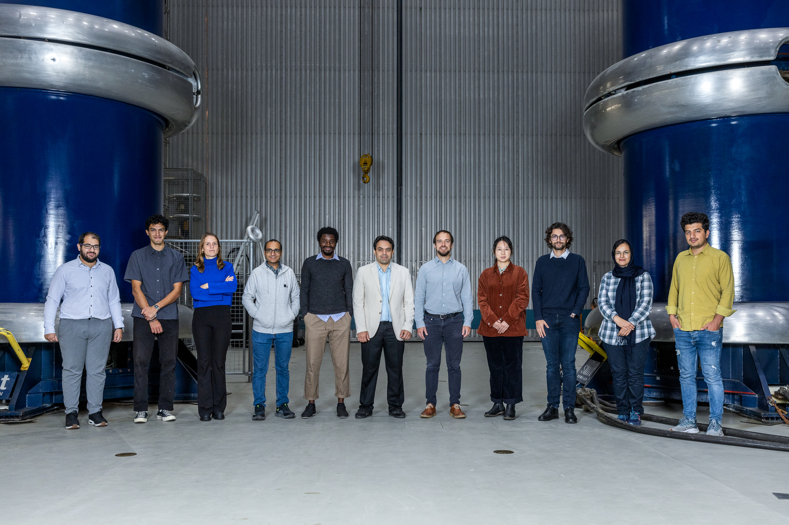

---

permalink: /
title: "About me"
author_profile: true
redirect_from: 
  - /about/
  - /about.html
---

I work as an Associate Professor at the [Electrical Engineering Mathematics and Computer Science Faculty at the Delft University of Technology](https://www.tudelft.nl/en/eemcs). I also conduct research at the [Delft AI Energy Lab](https://www.tudelft.nl/ai/delft-ai-energy-lab), work as a principal scientist at the [Austrian Institute of Technology in the Center for Energy](https://www.ait.ac.at/en/about-the-ait/center/center-for-energy), and co-direct (non-executive) the Canadian organisation [Student Energy](https://studentenergy.org/). 
Before that, I worked on Machine Learning applications for power systems at Imperial College London, Operations Research and Applied Control at Carnegie Mellon and MIT. During my studies, I worked in the chemical and energy industry, in China and Germany. I hold an M.Sc. in Chemical Engineering, a B.Sc. in Electrical Engineering, and a B.Sc. in Mechanical Engineering from RWTH Aachen University, Germany. I am an active member of the IEEE PES Taskforces and CIGRE C2 working groups.

I enjoy playing squash, running, hiking, sauna, sailing, skiing in the Alps, travelling to friends & family, and video games.

Delft AI Energy Lab
======
Our research develops fundamental methods based on AI and Machine learning that lead to new use cases in energy systems ranging from demand response to distributed real-time control over centralised coordinated operations in real-time. My team develops novel algorithms that can process substantial amounts of data and advance energy systems operations from societal, sustainable, and economic perspectives. Explore more about [Delft AI Energy Lab](https://www.tudelft.nl/ai/delft-ai-energy-lab)

Research
------
My vision is toward a fully data-driven operating paradigm of the control centres of the future, in distribution and transmission. This does not mean neglecting physical models but to include those as part of the “data” (others would say hybrids or physics-informed). Artificial Intelligence represents an alternative to handling complex systems with success in systematically handling very well images, molecular graphs, and human communication. The future electricity system requires fast (control and monitoring) actions and new foundations addressing the complexity of the operation of complex power systems. Currently, our team, among others develops either general AI-based models that can operate multiple (operating) tasks at once, and specialised AI-based models that can operate just one task but outperform conventional tooling. Eventually, my vision is that these will merge towards a system of AI in the control room.
Towards this vision, my research focuses on the reliability, security and resiliency of power system operation that requires monitoring and control of distribution and transmission systems. My team approaches these applications by developing new computational methods from machine learning (our focus) but also operations research and control, that are suited for this application area. Our way of working, and transferable competency, is to learn, and develop new computational methods fast and unlock new use cases within this application area. To realise this, our team combines “domain” expertise on these applications with a deepened understanding of machine learning techniques. 

Explore more about [Publications](https://www.tudelft.nl/ai/delft-ai-energy-lab)

Team
------
Our interdisciplinary team is combining specialists in data science, operations research and electrical engineering. We are part of the Delft AI Energy Lab that I am co-directing with [Peyman Mohajerin Esfahani](https://mohajerinesfahani.github.io/index.html) (based at TU Delft and University of Toronto). Structurally, we are within the Intelligent Electrical Power Grid section in the Department of [Electrical Sustainable Energy](https://www.tudelft.nl/en/eemcs/the-faculty/departments/electrical-sustainable-energy) that Peter Palensky heads. Currently, my team members are
-	[Olayiwola Arowolo](https://www.tudelft.nl/en/staff/o.a.arowolo/), topic “Graph-based Learning for Electromagnetic Transients”, TU Delft
-	[Paul Bannmüller](https://www.tudelft.nl/en/staff/p.e.bannmuller/), topic “Reinforcement Learning in Topology Control”, TU Delft
-	Périne Cunat, topic “Modelling Generating Alternatives for Heating and Electricity Networks”, TU Delft, Austrian Institute of Technology
-	[Demetris Chrysostomou](https://www.tudelft.nl/en/staff/d.chrysostomou/), topic “Estimating Flexibility of Distribution Grids at TSO/DSO interface”, TU Delft 
-	[Luca Hofstadler](https://www.tudelft.nl/staff/l.m.hofstadler), topic “Quantum Computing for Transmission Systems”, TU Delft, Austrian Institute of Technology
-	[Mert Karaçelebi](https://www.tudelft.nl/en/staff/m.karacelebi/), topic “Neural Networks for Dynamic Security Assessment” TU Delft
-	[Betül Mamudi](https://www.tudelft.nl/en/staff/b.mamudi/), topic “Machine Learning for State Estimation”, TU Delft, Alliander
-	[Basel Morsy](https://www.tudelft.nl/staff/b.morsy), topic “Reinforcement Learning for Topological Reconfigurations”, TU Delft, Austrian Institute of Technology
-	[Ali Rajaei](https://www.tudelft.nl/staff/a.rajaei), topic “System-theoretic Machine Learning for Congestion Management” TU Delft
-	[Jochen Stiasny](https://www.tudelft.nl/en/staff/j.b.stiasny/), topic “Physics-Informed Machine Learning for Power System Dynamics”, TU Delft
-	[Haiwei Xie](https://www.tudelft.nl/staff/h.xie-2), topic “Game Theory and Control of Distributed Energy”, TU Delft
-	[Runyao Yu](https://www.tudelft.nl/en/staff/runyao.yu), topic “Machine Learning for Outliers in Grids Operations and Intraday Energy Markets’, TU Delft, Austrian Institute of Technology
-	[Viktor Zobernig](https://www.tudelft.nl/staff/v.z.zobernig/), topic “Trading Strategies in Redispatch Markets”, TU Delft, Austrian Institute of Technology

Possibilities to join my team as PhD researcher
------
We offers an excellent environment from tailored education to key background and competencies to perform research on a very high scientific level in the area described above. Additionally, we are offering a competitive salary package to all our PhDs. We expect our new team members to have an excellent background in related domains (computer science, power systems, control or electrical engineering or related education background). We much encourage you to get in touch if you bring in this background on an excellent level, for example being among the top 10% among your peer students, and/or have already publications that demonstrate your research ambitions and previous performance, having won a merit-based award(s).

If you fulfil these criteria, please know that it is of key importance for our team to be diverse and include members with backgrounds that are disadvantaged and underrepresented. Diverse teams are the most fun and best teams :) So, for example, if you are female, if you are from a developing country and striving in your education, if you are the first person in your family with a bachelor's/master's degree, please get in touch as we would like to support you to make a good choice, which I believe is to join our team. 

If you do not fulfil these criteria, I still believe you can develop towards a PhD researcher (!), however, it represents a higher risk for us to hire you and it is not practical for us to offer you an interview as we receive typically 100+ applications for a single PhD position. Unfortunately, we cannot provide an interview to everyone, even though I would love to get to know you.

Possibilities to join my team as MSc thesis researcher
------ 
We are supporting MSc students to undertake research in this area within the scope of their thesis which frequently leads to scientific publications. Get in touch if you are interested.

Internship as visiting researcher (MSc or PhD)
------
If you plan to spend around 1 year at TU Delft, have a good PhD performance, and have an initial idea of how your research could fit into our work please get in touch. However, we have very limited capacity to host visiting researchers from other universities as we have a strong internal student base that we are supporting. This seldomly justifies the administrative (and supervision) overhead of spending less than 1 year in our group, but exceptions can be made.

If you are already an exchange student at TU Delft for your MSc degree, we may be able to arrange for you to write your MSc thesis in our team, for example, we have good experience hosting Erasmus students who consider extending their stay at TU Delft for their thesis work.

List of graduated PhD researchers
------
-	Al-Amin Bugaje, “Data Augmentation for Power System Security Assessment”, Imperial College London, now a researcher at Hitachi Energy, Canada
-	Federica Bellizio, “Topological Changes in Data-Driven Dynamic Security Assessment for Power System Control”, Imperial College London, now at Swiss Federal Laboratories for Materials Science and Technology & Co-Founder Kuafu
